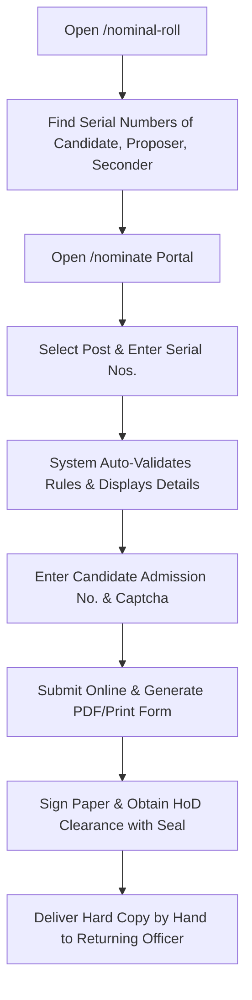

# 🎓 STUDENT GUIDE: NOMINATION PREPARATION & SUBMISSION
### College Union Elections — Comprehensive Handbook for Candidates, Proposers & Seconders
*Statutory Compliance Guide as per University Election Statutes & Lyngdoh Committee Recommendations*

---

## 📌 TABLE OF CONTENTS
1. [Important Principles & Timeline](#1-important-principles--timeline)
2. [Eligibility Criteria & Statutory Rules](#2-eligibility-criteria--statutory-rules)
3. [Mandatory Supporting Documents](#3-mandatory-supporting-documents)
4. [Roles & Endorsement Rules (Candidate, Proposer, Seconder)](#4-roles--endorsement-rules)
5. [Method A: Online Submission & Generation (Recommended)](#5-method-a-online-submission--generation)
6. [Method B: Manual / Physical Paper Filling](#6-method-b-manual--physical-paper-filling)
7. [The HoD Certificate (Academic & Attendance Clearance)](#7-the-hod-certificate)
8. [Common Rejection Pitfalls (Why Nominations Get Cancelled)](#8-common-rejection-pitfalls)
9. [Illustrative Examples & Case Studies](#9-illustrative-examples--case-studies)
10. [Pre-Submission Checklist](#10-pre-submission-checklist)

---

## 1. IMPORTANT PRINCIPLES & TIMELINE

Filing a nomination is a formal legal procedure under the University Student Union Election Statutes. Every nomination undergoes strict statutory scrutiny by the Returning Officer and Scrutiny Committee.

* **Filing Window:** Nominations can only be submitted during the dates and hours specified in the official Election Notification. Late submissions (even by 1 minute) are strictly rejected.
* **Two Filing Routes:**
  * **Method A (Digital Portal):** Enter details online ➔ System auto-verifies with Electoral Roll ➔ Print generated form with pre-filled details ➔ Collect physical signatures ➔ Submit to Returning Officer.
  * **Method B (Manual Physical):** Print a blank nomination paper ➔ Neatly handwrite all details in block letters ➔ Collect physical signatures ➔ Submit to Returning Officer.
* **Final Step for Both Routes:** The printed paper carrying original ink signatures and HoD certification **must be delivered by hand** to the Office of the Returning Officer before the statutory deadline. Online submission alone without physical delivery does **not** constitute a valid nomination.

---

## 2. ELIGIBILITY CRITERIA & STATUTORY RULES

Before choosing a post or asking students to propose/second your candidacy, ensure you satisfy all statutory criteria:

### A. Electoral Roll Registration (Mandatory)
* The Candidate, Proposer, and Seconder **must all be regular bona-fide students** of the college whose names appear in the published **Final Electoral Roll (Nominal Roll)**.
* Students whose names were omitted or who are only in a provisional/draft list cannot contest, propose, or second.

### B. Age Limits (Lyngdoh Committee Norms)
Calculated as on the qualifying date of the election year:
* **Under-Graduate (UG) Students:** Must be between **17 and 22 years of age**.
* **Post-Graduate (PG) Students:** Must not exceed **25 years of age**.
* **Research Scholars:** Under Lyngdoh Committee recommendations, Research Scholars are **barred** from contesting executive college union posts.

### C. Academic Standing & Attendance
* **No Academic Arrears:** The candidate must be progressing with their academic course without outstanding backlogs/arrears at the time of nomination.
* **Minimum 75% Attendance:** The candidate must possess the minimum mandatory 75% class attendance for the current academic session.
* Both conditions must be certified by the respective Head of the Department (HoD).

### D. Specific Post Restrictions
1. **Reserved Posts for Women:**
   * **Vice Chairperson** and **Joint Secretary** are statutorily reserved exclusively for female candidates. Male students cannot file nominations for these posts.
2. **Year/Class Representatives:**
   * **I UG Representative:** Only 1st Year UG students can contest, propose, and second.
   * **II UG Representative:** Only 2nd Year UG students can contest, propose, and second.
   * **III UG Representative:** Only 3rd Year UG students can contest, propose, and second.
   * **PG Representative:** Only Post-Graduate (1st or 2nd Year PG) students can contest, propose, and second.
3. **Association Secretaries (Department-Specific):**
   * Only students belonging to the respective department/discipline can contest for that Department Association Secretary.
   * Both the **Proposer** and **Seconder** must also belong to the **exact same department**.
4. **Chief Student Editor (Magazine Editor):**
   * Final-year students (3rd Year UG and 2nd Year PG) are ineligible to contest for Chief Student Editor, as the publication process extends past their final semester examinations.

### E. Security Deposit & Contest Limits
1. **Contest Limits:** A candidate has only **ONE opportunity** to contest for the post of an Office Bearer, and **TWO opportunities** to contest for the post of an Executive Member during their academic tenure.
2. **Security Deposit:** Each nomination for the following posts must be accompanied by a security deposit of **Rs. 50/-**:
   * Chairperson
   * Vice Chairperson
   * Secretary
   * Joint Secretary
   * University Union Councillor(s)
   * Secretary (Fine Arts)
   * Chief Student Editor (Magazine Editor)
   * General Captain (Sports & Games)
   
   **Refund Conditions:** The security deposit will be returned to the candidate if:
   1. The nomination is withdrawn within the prescribed time limit.
   2. The candidate secures at least **20% of the total votes polled** for the contested post.
   *(Note: Forfeited security deposits will be credited to the College Union Fund.)*

---

## 3. MANDATORY SUPPORTING DOCUMENTS

Every nomination paper must be accompanied by verified supporting documents. Failure to produce valid documentation during scrutiny will lead to immediate rejection.

| Document | Purpose | Acceptable Alternatives | Notes |
| :--- | :--- | :--- | :--- |
| **1. Proof of Date of Birth** | Verifies Lyngdoh age limit compliance (UG ≤ 22, PG ≤ 25) | • **SSLC / Secondary School Book** (Page with Name & DOB)<br/>• **Birth Certificate** (Panchayat / Municipality / Corporation)<br/>• **Passport** (Valid copy showing DOB)<br/>• **Aadhaar Card** (Only if full DD/MM/YYYY is printed) | **Self-attested copy** must be attached to the nomination form. Keep the original ready for physical verification. |
| **2. College Identity Proof** | Confirms identity and Admission Number | • **Official College Student ID Card**<br/>• Current Year Fee Receipt / Admission Slip | Must clearly show Admission No. and Department. |
| **3. Certificate from HoD** | Certifies 75% attendance and no academic backlogs | Printed certificate (Page 2 of Nomination Paper) | Must be signed by the Head of Department with the official **Department Rubber Stamp / Office Seal**. |
| **4. Security Deposit Receipt** | Proof of Rs. 50/- deposit for major posts | • **Original Chalan / College Fee Receipt** | Mandatory for major posts (Chairperson, Vice Chairperson, Secretary, Joint Secretary, U.U. Councillors, Sec. Fine Arts, Chief Student Editor, General Captain). Must accompany the nomination. |

> ⚠️ **CRITICAL WARNING ON DATE OF BIRTH:**
> Age is calculated as of the Notification Date (September 29, 2026).
> - **UG — Age Limit: 22** so Must be born on or after **September 29, 2004**
> - **PG — Age Limit: 25** Must be born on or after **September 29, 2001**
> If the Date of Birth mentioned on the nomination paper does not match the supporting document or if the candidate exceeds these statutory age ceilings by even a single day, the nomination **will be rejected with zero relaxation**.

---

## 4. ROLES & ENDORSEMENT RULES

A nomination requires **three distinct electors**:
1. **The Candidate:** The student seeking election to the post.
2. **The Proposer:** A voter from the electorate who proposes the candidate.
3. **The Seconder:** Another voter from the electorate who seconds the proposal.

### Strict Endorsement Rules:
* ✍️ **MANDATORY IN-PERSON SIGNING BEFORE RO:**
  * **Candidate, Proposer, and Seconder — ALL THREE MUST APPEAR IN PERSON AND SIGN BEFORE THE RETURNING OFFICER (RO) OR HIS/HER AUTHORIZED REPRESENTATIVE ONLY.**
  * *Malayalam:* **സ്ഥാനാർത്ഥി, നിർദ്ദേശകൻ, പിന്താങ്ങുന്നയാൾ എന്നീ 3 പേരും വരണാധികാരിയുടെയോ അദ്ദേഹത്തിന്റെ അധികാരപ്പെടുത്തിയ പ്രതിനിധിയുടെയോ മുന്നിൽ നേരിട്ട് ഹാജരായി മാത്രമേ ഒപ്പിടാൻ പാടുള്ളൂ.**
  * *Tamil:* **வேட்பாளர், முன்மொழிபவர் மற்றும் வழிமொழிபவர் ஆகிய மூவரும் தேர்தல் நடத்தும் அலுவலர் (RO) அல்லது அவரது அங்கீகரிக்கப்பட்ட பிரதிநிதியின் முன்னிலையில் மட்டுமே நேரில் ஆஜராகி கையொப்பமிட வேண்டும்.**
  * Pre-signed nomination papers or papers signed outside the direct presence of the Returning Officer / designated representative will be summarily rejected during scrutiny. All 3 individuals must bring their official College Identity Cards.
* ❌ **No Self-Endorsement:** A candidate **cannot** be their own proposer or seconder.
* ❌ **Proposer ≠ Seconder:** The proposer and seconder must be **two different persons**.
* ❌ **No Double Endorsements for the Same Post:**
  * An elector can propose or second **only ONE candidate** for any given post.
  * *Example:* If Student A signs as proposer for Candidate X for Chairperson, and also signs as proposer (or seconder) for Candidate Y for Chairperson, **both nominations will be invalidated during scrutiny**.
* ℹ️ **Cross-Post Endorsement:** An elector can propose someone for Chairperson and propose someone else for General Secretary, provided they are in the valid electorate for both.

---

## 5. METHOD A: ONLINE SUBMISSION & GENERATION (RECOMMENDED)

The fastest and error-free way to prepare your nomination is through the College Election Portal.



### Detailed Step-by-Step:
1. **Look Up Electoral Roll Serial Numbers:**
   * Go to the **Nominal Roll** page on the portal (`/nominal-roll`).
   * Search and note down the exact **Electoral Roll Serial Number** (`Sl. No.`), registered name spelling, and admission number for:
     1. Yourself (Candidate)
     2. Your Proposer
     3. Your Seconder
2. **Open Nomination Filing Page:**
   * Navigate to `/nominate`.
   * Select the **Post Applied For** from the dropdown menu.
   * Observe the rule badges displayed below the post (e.g., *Female Candidates Only*, *Dept Only*, *Year Restrictions*).
3. **Enter Serial Numbers:**
   * Enter your Candidate Electoral Roll Serial Number. The portal will automatically fetch and display your name, class, department, and admission number.
   * Alternatively, click the **"🔍 Find Sl. No."** button to search the nominal roll in real time.
4. **Candidate Identity Authentication:**
   * Enter your **Admission Number** in the authentication box. The system will verify that your entered admission number matches the nominal roll record for that serial number.
   * Select your **Gender** (Male / Female).
   * Select your exact **Date of Birth** (Day, Month, Year).
5. **Enter Proposer & Seconder Details:**
   * Type the Electoral Roll Serial Numbers for your Proposer and Seconder.
   * Ensure both students' names appear in green verification cards with correct departments.
6. **Rule Validation Check:**
   * If any statutory rule is violated (wrong department, barred year, age ceiling, duplicate endorsement), the system will display a red warning box. **You must resolve these warnings before submitting.**
7. **Submit & Print:**
   * Solve the security Captcha and click **Submit Nomination**.
   * Click **🖨️ Print Form** to print your official nomination paper and the attached HoD Certificate.
8. **Finalize Physical Document:**
   * Candidate signs the Consent section.
   * Proposer and Seconder sign their respective declarations.
   * Take the document to your Head of Department for certification, signature, and official seal.
   * Attach self-attested copies of your SSLC Book and College ID card.
   * Deliver to the Returning Officer before the deadline!

---

## 6. METHOD B: MANUAL / PHYSICAL PAPER FILLING

If you choose to fill the nomination form by hand, you must adhere to strict administrative handwriting and accuracy standards.

### 🚫 THE ZERO-TOLERANCE "NO CORRECTIONS" RULE
> ### ⚠️ STATUTORY NOTICE: NO STRIKE-OUTS OR OVERWRITING ALLOWED
> * When filling the physical nomination form, **NO CORRECTIONS, STRIKE-OUTS, WHITENER / CORRECTION FLUID, OR OVERWRITING IS PERMITTED**.
> * An illegible, altered, or overwritten entry will cause the nomination to be **rejected summarily during scrutiny**.
> * **If you make a spelling error or write the wrong serial number: DISCARD the paper, print a fresh blank form, and write again from the beginning.**

### Guidelines for Manual Filling:
1. **Pen & Ink:** Use only a **Black or Blue Ballpoint Pen**. Do not use gel pens (risk of smudging), pencils, or ink of any other color.
2. **Lettering:** Write clearly in **NEAT BLOCK CAPITAL LETTERS**.
3. **Exact Post Title:** Write the name of the post exactly as notified (e.g., `CHAIRPERSON`, `VICE CHAIRPERSON`, `GENERAL SECRETARY`, `ASSOCIATION SECRETARY COMMERCE`).
4. **Roll Serial Numbers:** Check the published Nominal Roll twice before writing the serial numbers of the Candidate, Proposer, and Seconder. An incorrect digit will invalidate the paper.
5. **Names & Admission Numbers:** Must correspond letter-for-letter to the college admission records.
6. **Date of Birth:** Must be written in `DD / MM / YYYY` format matching your SSLC book.

---

## 7. THE HoD CERTIFICATE

Page 2 of the nomination paper contains the statutory **Certificate from the Head of Department**.

```
────────────────────────────────────────────────────────────────────────
                   CERTIFICATE FROM HEAD OF DEPARTMENT
This is to certify that ................................................
(Admission No: ............., Nominal Roll Sl. No: .............),
a student of .................... class in this department, has no 
academic arrears and maintains the necessary minimum attendance (75%) 
as prescribed by the University election rules and bylaws to contest in 
the College Union Election 2026.

Date: _____ / _____ / 2026                 _____________________________
Place: ___________________                  Name & Signature of the HoD
                                            Department of ______________
                                                   (Office Seal)
────────────────────────────────────────────────────────────────────────
```

### Instructions regarding HoD Certificate:
* The certificate **must be signed by the permanent or designated Head of the Department** in which the candidate is enrolled.
* In the absence of the HoD, an authorized senior faculty member acting on official charge may sign, noting their designation.
* **The Department Seal / Office Rubber Stamp is mandatory.** Forms without an official seal will be flagged during scrutiny.

---

## 8. COMMON REJECTION PITFALLS
### (Why Nominations Get Cancelled During Scrutiny)

Study this list carefully to avoid technical disqualification:

| # | Pitfall / Error | Reason for Rejection |
| :-: | :--- | :--- |
| **1** | **Wrong Roll Serial Number** | The student's serial number on the nomination does not match the final published Electoral Roll. |
| **2** | **Overwriting / Correction Fluid** | Any paper with whitener, scratched-out text, or overwritten digits is immediately disqualified. |
| **3** | **Proposer / Seconder Mismatch** | For Association posts, the proposer or seconder belongs to a different department than the post. |
| **4** | **Duplicate Endorsement** | The proposer or seconder signed nomination papers for two different candidates for the same post. |
| **5** | **Self-Proposal / Same Proposer-Seconder** | Candidate signed as proposer, or the same elector signed as both proposer and seconder. |
| **6** | **Age Limit Exceeded** | UG candidate aged > 22 or PG candidate aged > 25 on the cutoff date, or lack of verified DOB proof. |
| **7** | **Final Year Contesting for Editor** | 3rd UG or 2nd PG student filed nomination for Chief Student Editor. |
| **8** | **Male Nominated for Reserved Seat** | Male student filing for Vice Chairperson or Joint Secretary. |
| **9** | **Missing HoD Sign or Seal** | Page 2 missing faculty signature, attendance clearance, or department seal. |
| **10** | **Missing Security Deposit Receipt** | Failure to attach the Rs. 50/- deposit receipt for major posts. |
| **11** | **Late Submission** | Handing in the paper even 1 minute past the statutory deadline bell. |

---

## 9. ILLUSTRATIVE EXAMPLES & CASE STUDIES

### Scenario A: General Union Executive Post (Chairperson)
* **Post:** `CHAIRPERSON`
* **Candidate:** Rahana K. P. (III BA English, Roll Sl. # 142, Adm No: 18452, Female, Age: 20)
* **Proposer:** Jithin Raj (II B.Com, Roll Sl. # 89, Adm No: 19104)
* **Seconder:** Sneha Menon (I B.Sc Physics, Roll Sl. # 210, Adm No: 20311)
* **Status:** ✅ **VALID.** Any regular student from any class/department can propose and second a general post candidate. Age is within 22 years.

---

### Scenario B: Department Post (Association Secretary - Commerce)
* **Post:** `ASSOCIATION SECRETARY COMMERCE`
* **Candidate:** Arjun M. (II B.Com, Roll Sl. # 78, Adm No: 19082)
* **Proposer:** Divya K. (III B.Com, Roll Sl. # 95, Adm No: 18210)
* **Seconder:** Muhammed Fayis (I B.Com, Roll Sl. # 61, Adm No: 20455)
* **Status:** ✅ **VALID.** Candidate, Proposer, and Seconder all belong to the Department of Commerce.
* ❌ *Invalid Scenario:* If the Seconder was from BA Economics, the nomination would be rejected immediately.

---

### Scenario C: Class Representative (I UG Representative)
* **Post:** `I UG REPRESENTATIVE`
* **Candidate:** Anjali Das (I B.Sc Mathematics, Roll Sl. # 312, Adm No: 20114)
* **Proposer:** Kevin Peter (I BA English, Roll Sl. # 28, Adm No: 20045)
* **Seconder:** Fathima N. (I B.Com, Roll Sl. # 54, Adm No: 20088)
* **Status:** ✅ **VALID.** Candidate, Proposer, and Seconder are all 1st Year Under-Graduate students across any department.

---

## 10. PRE-SUBMISSION CHECKLIST

Before submitting your nomination to the Returning Officer, tick off every item on this checklist:

- [ ] **Electoral Roll Check:** Have you verified the exact Roll Serial Numbers of Candidate, Proposer, and Seconder against the Final Nominal Roll?
- [ ] **Department / Year Match:** If contesting for an Association Secretary or Year Rep post, do all three parties satisfy the department/year criteria?
- [ ] **Gender Check:** If applying for Vice Chairperson or Joint Secretary, is the candidate female?
- [ ] **Age Check:** Does the candidate's age meet the Lyngdoh limit (UG ≤ 22, PG ≤ 25)?
- [ ] **Endorsement Check:** Has your Proposer or Seconder signed for any other candidate for this specific post?
- [ ] **Signatures Collected:**
  - [ ] Proposer signature with date
  - [ ] Seconder signature with date
  - [ ] Candidate consent signature with date
- [ ] **HoD Certification:**
  - [ ] HoD has signed Page 2 certifying minimum 75% attendance and no academic backlogs
  - [ ] Official Department Rubber Stamp / Office Seal is clearly stamped
- [ ] **Enclosures Attached:**
  - [ ] Self-attested copy of SSLC Book / Secondary School Certificate (Proof of Date of Birth)
  - [ ] Copy of College Identity Card
- [ ] **Condition of Paper:**
  - [ ] If filled manually: Absolutely NO whitener, NO scratched-out writing, NO corrections.
- [ ] **Time Management:** Are you submitting well ahead of the deadline hour to avoid last-minute rush or disqualification?

---

*Issued under the Authority of the Returning Officer / Election Scrutiny Committee.*  
*For questions or clarifications, contact the Election Facilitation Desk in the College Office.*
